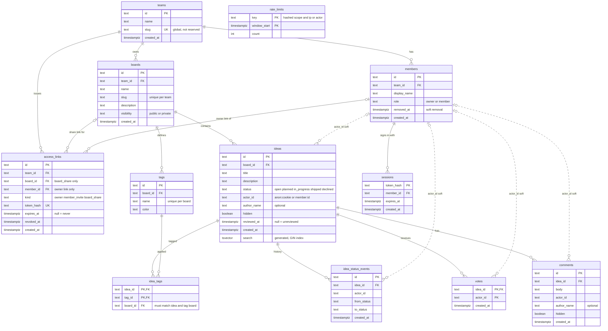

# Database ER diagram

Status: **implemented** in `src/db/schema.ts` (migration `drizzle/0001_*.sql`). Terms follow [`CONTEXT.md`](../CONTEXT.md); behaviour follows [`SPEC.md`](../SPEC.md). Single Postgres schema (Drizzle `pg-core`) for PGlite locally and Neon in production, see [ADR 0001](adr/0001-pglite-local-postgres-everywhere.md).

Solid lines are real foreign keys. Dotted lines are "soft" links through `actor_id`, a plain string (`anon:<cookie-id>` or `member:<member-id>`) with no foreign key, so a Visitor's cookie and a Member can author the same kinds of rows.

## Deletion and removal

Teams and Boards are **deleted** for good (hard delete, no undo, cascading down the tree). Members are only **removed**: the row stays with `removed_at` set, so their past Ideas and Comments keep their display name. Ideas and Comments are never deleted, only hidden. See `SPEC.md` G8 and US-3.4, US-3.7, US-3.8, US-4.3.

| Parent    | Child                                                  | On delete of parent                                    |
| --------- | ------------------------------------------------------ | ------------------------------------------------------ |
| `teams`   | `members`, `boards`, `access_links`                    | CASCADE                                                |
| `boards`  | `ideas`, `tags`, `access_links` (share links)          | CASCADE                                                |
| `members` | `sessions`, `access_links` (owner link)                | CASCADE (members are only hard-deleted through a team) |
| `ideas`   | `votes`, `comments`, `idea_status_events`, `idea_tags` | CASCADE                                                |
| `tags`    | `idea_tags`                                            | CASCADE                                                |

The slug of a deleted Team or Board is freed immediately.

## Constraints

- **Text with checks, no native enums:** `ideas.status`, `members.role`, `boards.visibility` and `access_links.kind` each have a check constraint.
- **`actor_id` shape:** must match `anon:%` or `member:%` on `ideas`, `votes`, `comments` and `idea_status_events`. Whether a `member:` id exists is checked by the app, not the database.
- **Link shape (`access_links`):** `owner` needs `member_id` and no `board_id`; `member_invite` has neither; `board_share` needs `board_id` and no `member_id`.
- **Uniques:** `teams.slug`; `boards (team_id, slug)`; `tags (board_id, name)`; `access_links.token_hash`; `votes (idea_id, actor_id)` as its primary key.
- **Same-board tags:** `idea_tags` carries `board_id` and uses composite foreign keys `(idea_id, board_id)` to `ideas (id, board_id)` and `(tag_id, board_id)` to `tags (id, board_id)`, so a tag can only be applied to an Idea on its own Board. This needs a unique on `(id, board_id)` in both `ideas` and `tags`.
- **Ids and time:** application-generated string ids; all timestamps are `timestamptz`.
- **Last Owner:** "the last Owner cannot be removed or leave" is enforced in the application, inside the same transaction as the removal.

## Indexes

- `ideas (board_id, status, created_at)` for the board list and roadmap.
- Partial `ideas (board_id, created_at) WHERE reviewed_at IS NULL` for the moderation queue.
- GIN on `ideas.search` for keyword search and the similar-ideas hint.
- `comments (idea_id, created_at)`.
- `members (team_id)`, `boards (team_id)`, `tags (board_id)`.
- Primary keys cover `votes`, `idea_tags`, `sessions` and `rate_limits`.

## Computed, not stored

Vote counts and comment counts are aggregated by query (no counter columns, SPEC NF3: no N+1). Roadmap columns, board idea counts and "unreviewed" counts are queries too.

## Privacy notes

- Link and session tokens are stored only as hashes.
- `rate_limits.key` is a **hash** of the scope plus the IP or actor, never a raw IP (SPEC NF6). Old windows are purged.
- Visitor access to a Private board is held in a signed cookie, not in the database.

## Open items to verify during implementation

- Verified: PGlite supports the generated `tsvector` column and GIN index; Drizzle expresses the composite foreign keys, partial index and check constraints, so the migration is fully generated.
- Verified (2026-10-10): the migrations, seed and the integration tests run against a real Neon Postgres 17 database, and the app runs on it through Neon's HTTP driver.
